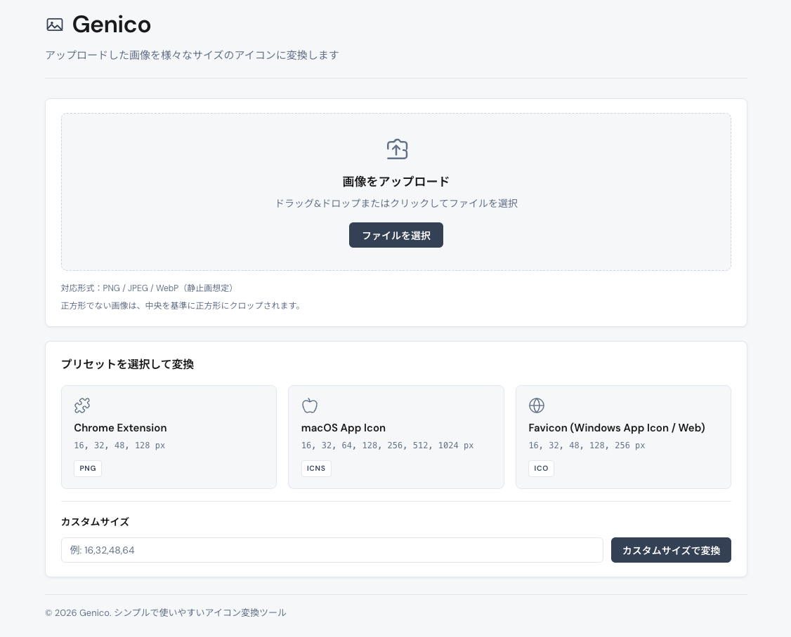

# Genico

ブラウザから1枚の画像を渡すと、Chrome 拡張用の複数 PNG、`favicon.ico`、macOS の `AppIcon.icns`（または iconset の ZIP）など、アイコン用のサイズ別ファイルをまとめて取り出せるローカル向けのツールです。手元の変換コマンドやスクリプトを毎回そろえる手間を減らしたいとき向けで、サーバー側の依存は Python と Pillow が中心です。



## 特徴

- ドラッグ＆ドロップ、またはクリックでアップロード
- プリセットで Chrome Extension / macOS App Icon / Favicon 向けのサイズセットをワンクリックで、中身は `presets/presets.json` で差し替え可能
- カンマ区切りで任意の正方サイズ列を指定して変換
- 複数ファイルになる出力は ZIP にまとめてダウンロード（プリセットの `bundle` 設定に従う）
- UI はブラウザだけで、見た目はニュートラルなツール寄りのレイアウト

## 対応画像形式

### 入力形式

- PNG
- JPEG/JPG
- WebP（静止画想定）

### 出力形式

- PNG
- ICO（Web ファビコン用。1 ファイルに複数サイズを内包できる）
- ICNS（macOS アプリアイコン。`iconutil` が無い環境では `.iconset` 相当を ZIP で返す）

## インストールと起動

### uv を使う（推奨）

依存のインストール:

```bash
uv sync
```

サーバー起動:

```bash
uv run server.py
```

デフォルトは `0.0.0.0:8000` なので、同一 LAN からも見える設定です。ローカルだけにしたい場合は `-H localhost`。ポートは `-p` で変更できます。

```bash
uv run server.py -p 3000
uv run server.py -H localhost
```

エントリポイント経由:

```bash
uv run genico
```

ブラウザで `http://localhost:8000` を開く（ポートを変えた場合はその番号に合わせる）。

### pip を使う場合

```bash
pip install -r requirements.txt
python server.py
```

起動時のオプション（`-p` / `-H`）と挙動は、上の uv の例と同じです。`python server.py` と `uv run server.py` の違いは、Python 環境の作り方だけです。

## 使用方法

1. 画像をアップロード（ドラッグ＆ドロップまたは「ファイルを選択」）
2. プリセットのカードをクリックするか、カスタムサイズ欄に `16,32,48,64` のようにカンマ区切りで入力して変換
3. 処理が終わるとブラウザのダウンロードで成果物を受け取る

長方形の画像は、サーバー側で中央から正方形にクロップしてからリサイズします。端が落ちるので、重要なモチーフは中央寄せにしておくと安全です。

## プリセットの追加（設定ファイルの書き方）

`presets/presets.json` にプリセットを定義します。各エントリに使えるキーは次のとおりです。

- `name`（必須）: 表示名
- `sizes`（必須）: 出力サイズの配列（整数、正方）
- `format`（必須）: 出力形式（`png` | `ico` | `icns`）
- `bundle`（任意）: 出力の束ね方
  - `single`: 単一ファイル（例: 1 つの `ico`）
  - `zip`: 複数ファイルを ZIP で返す（例: 複数 PNG）
  - `icns`: 可能なら `.icns` 単体（不可なら `.iconset.zip`）
- `filename_pattern`（任意）: ファイル名規則。プレースホルダ:
  - `{size}`: サイズ数値（例: 16）
  - `{preset}`: プリセット ID（例: chrome_extension）
  - `{ext}`: 拡張子（`png` / `ico` / `icns`）

最小例:

```json
{
  "your_preset": {
    "name": "あなたのプリセット名",
    "sizes": [16, 32, 48, 64, 128],
    "format": "png"
  }
}
```

同梱プリセットに近い例（実際の `sizes` や `name` はリポジトリの `presets/presets.json` を参照）:

```json
{
  "chrome_extension": {
    "name": "Chrome Extension",
    "sizes": [16, 32, 48, 128],
    "format": "png",
    "bundle": "zip",
    "filename_pattern": "icon{size}.png"
  },
  "macos_icon": {
    "name": "macOS App Icon",
    "sizes": [16, 32, 64, 128, 256, 512, 1024],
    "format": "icns",
    "bundle": "icns",
    "filename_pattern": "AppIcon.icns"
  },
  "favicon": {
    "name": "Favicon (Windows App Icon / Web)",
    "sizes": [256, 128, 48, 32, 16],
    "format": "ico",
    "bundle": "single",
    "filename_pattern": "favicon.ico"
  }
}
```

注意:

- macOS 用 `icns` は、マシンに `iconutil` があるときだけバイナリの `.icns` を返し、無い場合は `.iconset` 相当を ZIP にします
- 設定は起動時に読み込むので、JSON を直したあとはサーバーを再起動してください

## 技術仕様

Python 3.8 以上。HTTP は標準ライブラリの `http.server`、画像処理は Pillow、フロントはバニラ JavaScript と CSS。アップロードは 1 ファイル 10MB まで。既定の待ち受けポートは 8000 です。

## ライセンス

MIT License
